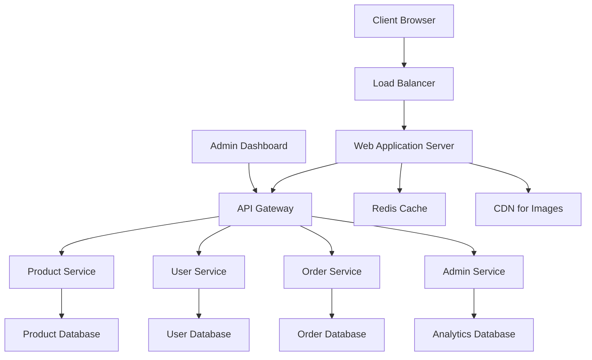

# Agricultural E-commerce Design Document

## Overview

This document outlines the technical design for a scalable agricultural e-commerce web application. The system is designed to handle 20,000+ product SKUs with efficient filtering, responsive design, and comprehensive administrative features. The architecture follows modern web development practices with a focus on performance, scalability, and user experience.

## Architecture

### High-Level Architecture

The application follows a modern full-stack architecture with clear separation of concerns:



### Technology Stack

**Frontend:**
- **Framework**: Next.js 14 with React 18 (for SSR/SSG and SEO optimization)
- **Styling**: Tailwind CSS with custom agricultural theme
- **State Management**: Zustand for client-side state
- **Image Optimization**: Next.js Image component with CDN integration
- **Forms**: React Hook Form with Zod validation

**Backend:**
- **Runtime**: Node.js with TypeScript
- **Framework**: Express.js with tRPC for type-safe APIs
- **Database**: PostgreSQL with Prisma ORM
- **Caching**: Redis for session management and product caching
- **File Storage**: AWS S3 or Cloudinary for product images
- **Search**: Elasticsearch for advanced product search

**Infrastructure:**
- **Deployment**: Docker containers with Kubernetes orchestration
- **CDN**: CloudFront or Cloudflare for static asset delivery
- **Monitoring**: Application performance monitoring and logging
- **Security**: JWT authentication, rate limiting, and input validation

## Components and Interfaces

### Frontend Components

#### Core Layout Components
```typescript
// Layout structure
interface LayoutProps {
  children: React.ReactNode;
  showHeader?: boolean;
  showFooter?: boolean;
}

// Header with navigation and search
interface HeaderProps {
  categories: ProductCategory[];
  cartItemCount: number;
  user?: User;
}

// Footer with agricultural theme
interface FooterProps {
  companyInfo: CompanyInfo;
  socialLinks: SocialLink[];
}
```

#### Product Components
```typescript
// Product grid with filtering
interface ProductGridProps {
  products: Product[];
  filters: ProductFilters;
  onFilterChange: (filters: ProductFilters) => void;
  loading: boolean;
}

// Individual product card
interface ProductCardProps {
  product: Product;
  showQuickView?: boolean;
  variant?: 'grid' | 'list';
}

// Product detail view
interface ProductDetailProps {
  product: ProductWithImages;
  relatedProducts: Product[];
  onAddToCart: (productId: string, quantity: number) => void;
}
```

#### Home Page Components
```typescript
// Promotional banner slider
interface PromoBannerProps {
  banners: PromoBanner[];
  autoSlideInterval?: number;
}

// Product group icons grid
interface ProductGroupIconsProps {
  groups: ProductGroup[];
  onGroupSelect: (groupId: string) => void;
}
```

#### Admin Components
```typescript
// Inventory management interface
interface InventoryManagerProps {
  products: ProductWithStock[];
  onUpdateStock: (productId: string, stock: number) => void;
  onUpdateProduct: (product: Product) => void;
}

// Sales dashboard
interface SalesDashboardProps {
  salesData: SalesMetrics;
  dateRange: DateRange;
  onDateRangeChange: (range: DateRange) => void;
}
```

### Backend API Structure

#### Product Service
```typescript
// Product management endpoints
interface ProductService {
  getProducts(filters: ProductFilters, pagination: Pagination): Promise<ProductPage>;
  getProductById(id: string): Promise<ProductWithImages>;
  getRelatedProducts(productId: string, limit: number): Promise<Product[]>;
  searchProducts(query: string, filters?: ProductFilters): Promise<Product[]>;
  
  // Admin endpoints
  createProduct(product: CreateProductInput): Promise<Product>;
  updateProduct(id: string, updates: UpdateProductInput): Promise<Product>;
  updateStock(id: string, stock: number): Promise<void>;
}
```

#### User Service
```typescript
// User management and authentication
interface UserService {
  register(userData: RegisterInput): Promise<AuthResponse>;
  login(credentials: LoginInput): Promise<AuthResponse>;
  getProfile(userId: string): Promise<UserProfile>;
  updateProfile(userId: string, updates: ProfileUpdate): Promise<UserProfile>;
  resetPassword(email: string): Promise<void>;
}
```

#### Order Service
```typescript
// Shopping cart and order management
interface OrderService {
  addToCart(userId: string, item: CartItem): Promise<Cart>;
  getCart(userId: string): Promise<Cart>;
  updateCartItem(userId: string, itemId: string, quantity: number): Promise<Cart>;
  checkout(userId: string, checkoutData: CheckoutInput): Promise<Order>;
  getOrderHistory(userId: string): Promise<Order[]>;
}
```

## Data Models

### Core Product Models
```typescript
interface Product {
  id: string;
  sku: string;
  name: string;
  description: string;
  price: number;
  salePrice?: number;
  categoryId: string;
  groupId: string;
  subGroupId: string;
  stock: number;
  isActive: boolean;
  images: ProductImage[];
  specifications: ProductSpec[];
  createdAt: Date;
  updatedAt: Date;
}

interface ProductImage {
  id: string;
  productId: string;
  url: string;
  altText: string;
  sortOrder: number;
  isMain: boolean;
}

interface ProductCategory {
  id: string;
  name: string;
  slug: string;
  description?: string;
  parentId?: string;
  children?: ProductCategory[];
}

interface ProductGroup {
  id: string;
  name: string;
  slug: string;
  iconUrl: string;
  description?: string;
  subGroups: ProductSubGroup[];
}
```

### User and Order Models
```typescript
interface User {
  id: string;
  email: string;
  firstName: string;
  lastName: string;
  phone?: string;
  isAdmin: boolean;
  addresses: Address[];
  createdAt: Date;
}

interface Order {
  id: string;
  userId: string;
  status: OrderStatus;
  items: OrderItem[];
  subtotal: number;
  tax: number;
  shipping: number;
  total: number;
  shippingAddress: Address;
  billingAddress: Address;
  paymentMethod: PaymentMethod;
  createdAt: Date;
}

interface Cart {
  id: string;
  userId: string;
  items: CartItem[];
  subtotal: number;
  updatedAt: Date;
}
```

### Admin and Analytics Models
```typescript
interface SalesMetrics {
  totalRevenue: number;
  totalOrders: number;
  averageOrderValue: number;
  topSellingProducts: ProductSalesData[];
  salesByCategory: CategorySalesData[];
  salesByPeriod: PeriodSalesData[];
}

interface InventoryAlert {
  id: string;
  productId: string;
  alertType: 'LOW_STOCK' | 'OUT_OF_STOCK';
  threshold: number;
  currentStock: number;
  createdAt: Date;
}
```

## Error Handling

### Frontend Error Handling
- **Global Error Boundary**: Catch and display user-friendly error messages
- **API Error Handling**: Standardized error responses with appropriate HTTP status codes
- **Form Validation**: Real-time validation with clear error messages
- **Network Error Handling**: Retry mechanisms and offline state management

### Backend Error Handling
```typescript
// Standardized error response format
interface ApiError {
  code: string;
  message: string;
  details?: any;
  timestamp: Date;
}

// Error types
enum ErrorCodes {
  VALIDATION_ERROR = 'VALIDATION_ERROR',
  NOT_FOUND = 'NOT_FOUND',
  UNAUTHORIZED = 'UNAUTHORIZED',
  INSUFFICIENT_STOCK = 'INSUFFICIENT_STOCK',
  PAYMENT_FAILED = 'PAYMENT_FAILED'
}
```

### Database Error Handling
- **Connection pooling**: Manage database connections efficiently
- **Transaction management**: Ensure data consistency for critical operations
- **Constraint violations**: Handle unique constraint and foreign key violations
- **Performance monitoring**: Track slow queries and optimize database performance

## Testing Strategy

### Frontend Testing
- **Unit Tests**: Jest and React Testing Library for component testing
- **Integration Tests**: Test user workflows and API integration
- **E2E Tests**: Playwright for critical user journeys
- **Visual Regression Tests**: Ensure UI consistency across updates
- **Accessibility Tests**: Automated a11y testing with axe-core

### Backend Testing
- **Unit Tests**: Jest for service and utility function testing
- **Integration Tests**: Test API endpoints with test database
- **Load Tests**: Artillery or k6 for performance testing with 20k+ products
- **Security Tests**: Automated security scanning and penetration testing

### Test Coverage Goals
- **Unit Tests**: 80%+ code coverage
- **Integration Tests**: Cover all critical user paths
- **E2E Tests**: Cover complete purchase flow and admin workflows
- **Performance Tests**: Ensure sub-2-second page load times

### Agricultural Theme Implementation

#### Color Palette
```css
:root {
  /* Primary Colors */
  --agricultural-green: #2D5016;
  --agricultural-green-light: #4A7C23;
  --agricultural-green-dark: #1A3009;
  
  /* Secondary Colors */
  --dirt-brown: #8B4513;
  --dirt-brown-light: #A0522D;
  --dirt-brown-dark: #654321;
  
  /* Accent Colors */
  --harvest-gold: #DAA520;
  --earth-beige: #F5E6D3;
  --leaf-green: #228B22;
}
```

#### Typography and Styling
- **Primary Font**: Inter or similar clean sans-serif for readability
- **Accent Font**: Playfair Display for headings to add agricultural character
- **Icons**: Custom agricultural-themed icons for product groups
- **Imagery**: High-quality agricultural and farming imagery throughout

#### Responsive Breakpoints
```css
/* Mobile First Approach */
--mobile: 320px;
--tablet: 768px;
--desktop: 1024px;
--large-desktop: 1440px;
```

This design provides a solid foundation for building a scalable, performant agricultural e-commerce application that meets all the specified requirements while maintaining excellent user experience across all devices.